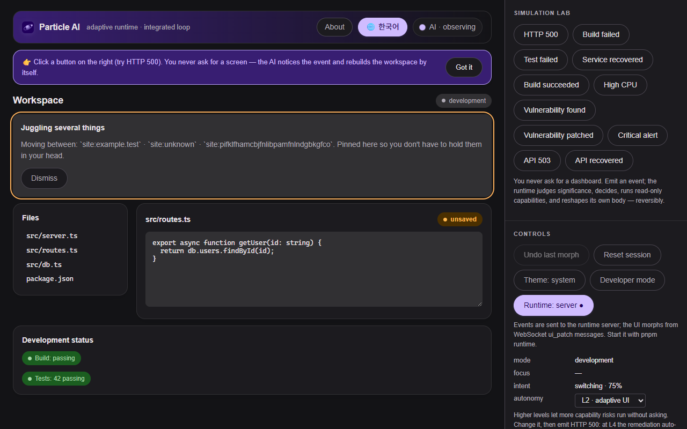

# Particle AI

[](https://github.com/yehsb123/particle-AI/actions/workflows/ci.yml)
[](LICENSE)

An AI **layer over your computer**: it watches how you work — clicks, dwell, tab switches,
undo, idle time, and the *shape* of your traffic (host · status · latency, never content) —
keeps a continuous guess about what you are trying to do, and reshapes its own interface
around you **before and without anything breaking**.

Instead of asking AI to use software, the AI **becomes** the software.

> ⚠️ Experimental research software. Not production-ready.

[한국어 README →](README.ko.md) · **[Quickstart — feel it in 5 minutes →](QUICKSTART.md)**

## The idea

Conventional generative AI is `prompt → model → response`. Particle AI runs a
continuous loop instead:

```
observe → understand → evaluate significance → infer intent → decide
→ select intelligence → select capabilities → act → morph the interface
→ observe the result → repeat
```

The interface is the AI's body; behavior is its senses. Come back after being away and a
re-entry summary is waiting. Repeat the same action three times and related context appears
beside your work. Keep alternating between two files and they get pinned. A dependency
starts failing — read from the shape of the traffic, not its content — and a connection view
opens, then closes itself on recovery. Errors (a failing build, an HTTP 500) are just **one
case** of this: the user never typed "show me the error dashboard." And undo is feedback —
dismiss the same kind of change twice and it stops being offered.

Where the senses come from (each layer opt-in, shape only):

| Layer | Sensor | What it observes |
|---|---|---|
| this page | `apps/web` | clicks, dwell, idle, tab visibility |
| the browser | `apps/extension` (MV3) | tab focus, site hostnames, interaction counts; traffic shape (opt-in) |
| the desktop | `apps/agent` (Node, opt-in) | file saves (relative paths), git branch switches, test/build pass↔fail |

The body always shows *what is currently being sensed*, from what the sensors themselves report.

```
   the page          the browser            the desktop
  apps/web        apps/extension (MV3)     apps/agent (opt-in)
  clicks·dwell    tabs·hosts·traffic       file saves·git branch
  idle·returns    shape (opt-in)           test/build transitions
      │                  │                        │            shape only,
      └────────────── ordered, serialized events ─┘            never content
                             ▼
                ┌─ Particle AI runtime (local) ─┐
                │ world model → significance    │   every decision audited,
                │ → intent (always on) → brain  │   every change reversible,
                │ → permissions → capabilities  │   event-sourced replay
                │ → morph guard → reconcile     │
                └───────────────┬───────────────┘
                                ▼
                    the BODY (apps/web / side panel)
              reshapes itself before anything breaks;
              learns from your dismissals; shows honestly
              what it senses
```

Reliability guardrails make this safe:

- The model only emits **validated UI data** (`UIBlueprint` / `UIPatch`), never executable code.
- A **Morph Guard** prevents the UI from jumping around: cooldowns, dwell times, focus protection.
- Every morph is **reversible** (undo) and every decision is **auditable**.
- The whole thing runs in **deterministic mock mode** with no API key.
- Providers are abstract — swap Anthropic / OpenAI / a local model without touching the core.



## Quick start

```bash
pnpm install
pnpm test          # all unit/integration suites (~2 min)
pnpm dev           # web (3000) + runtime (8787) together — or `pnpm web` / `pnpm runtime` separately
```

Ports and settings come from env (`PORT`, `DM_PORT`, …) and are passed through turbo, so
`DM_PORT=8790 PORT=3010 pnpm dev` works. See `.env.example` for every variable.

No API key is required — the runtime uses a deterministic mock provider by default.
To enable a real provider, copy `.env.example` to `.env` and fill in a key.

## Browser extension (Concept v2)

Particle AI is a **layer over the browser**, not just one page. `apps/extension` (MV3) senses
tab focus, navigation hostnames, interaction counts, idle time and — opt-in — the *shape* of
network traffic (host · status · latency, never paths or bodies), and shows the body in a
side panel on any site.

```bash
pnpm --filter @particle/extension build   # -> apps/extension/dist
pnpm runtime && pnpm web                  # runtime :8787, body :3000
```

`chrome://extensions` → Developer mode → **Load unpacked** → `apps/extension/dist`.
Consent per sensing layer lives in the extension's Options page. See
[`apps/extension/README.md`](apps/extension/README.md) and [`docs/CONCEPT_V2.md`](docs/CONCEPT_V2.md).

## Desktop agent (opt-in)

`apps/agent` extends sensing to the editor and terminal — still shape only: file **saves**
(relative paths) and test/build **pass↔fail transitions** from piped output.

```bash
DM_WATCH_PATHS=. pnpm agent      # sense file saves
pnpm test 2>&1 | pnpm agent      # sense a run's transitions (output is passed through)
```

See [`apps/agent/README.md`](apps/agent/README.md).

## Runtime access control

The runtime holds a shape-level record of what you did, so by default it only talks to you:

| Setting | Default | Meaning |
|---|---|---|
| `DM_HOST` | `127.0.0.1` | bind address — set `0.0.0.0` only to expose it on your LAN |
| `DM_ALLOWED_ORIGINS` | `http://localhost:3000,http://127.0.0.1:3000` | browser origins allowed to read/write; `chrome-extension://` origins are always allowed; any other page gets no CORS grant and a 403 |
| `DM_INGEST_TOKEN` | *(empty)* | optional shared secret — when set, every read and write needs `x-particle-token` (WS: `?token=`); the extension takes it in its options page, the agent from the same env var |

Reads never create sessions, so unknown ids cannot evict real ones. Shape-only is enforced at the
sensors; the runtime trusts the body, the extension and token holders.

## Architecture

See [`docs/ARCHITECTURE.md`](docs/ARCHITECTURE.md) and the runtime loop in
[`docs/RUNTIME_LOOP.md`](docs/RUNTIME_LOOP.md). Design decisions live in
[`docs/adr/`](docs/adr/). Current progress is tracked in
[`docs/STATUS.md`](docs/STATUS.md).

## Status

Phases 0–8 (runtime, UI matter, capabilities, memory, persistence, reliability) are done, and
Concept v2 — the behavior layer — is implemented end to end: intent engine (P1), browser
extension + traffic-shape incidents (P2), desktop agent (P3), learning from dismissals (P4),
honest sensing indicator. Unit/integration suite, 15 Playwright E2E tests across 14 specs (including a real
extension test against the live runtime and a Korean options page) and CI are green. Details: [`docs/STATUS.md`](docs/STATUS.md),
[`docs/CONCEPT_V2.md`](docs/CONCEPT_V2.md).

## License

[MIT](LICENSE) — © 2026 Particle AI contributors. Experimental research software.
